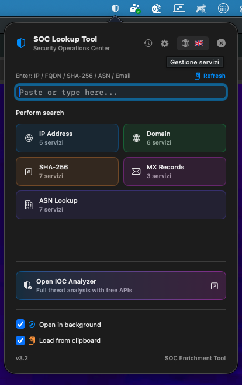
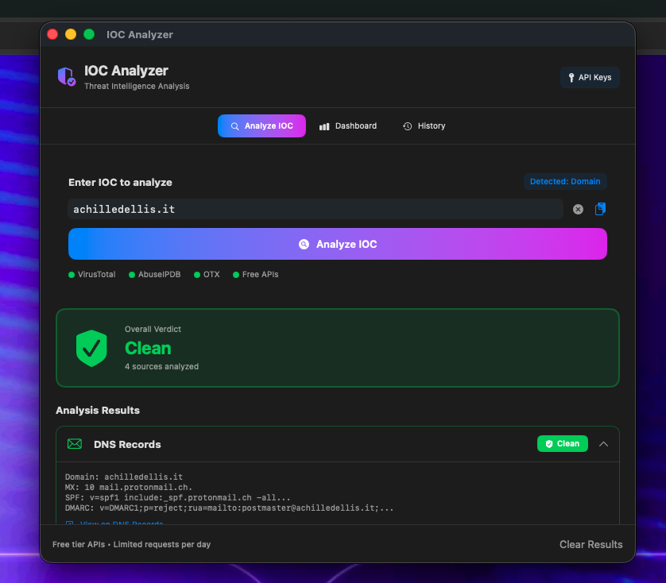

# 🛡️ SOC Enrich Tool for macOS


**SOC Enrich Tool** is an advanced, open-source macOS application designed for **SOC analysts, threat hunters, DFIR teams, and cybersecurity professionals**.

It provides fast and reliable **IOC enrichment** by combining open-source intelligence, heuristic analysis, and optional API-based services in a privacy-friendly and fully sandboxed macOS environment.

Starting from **v3.0,1**, SOC Enrich Tool adopts a **dual-application architecture**:

- 🪟 A **menu bar application** for instant lookups and rapid IOC triage
- 🖥️ A **traditional macOS application (IOC Analyzer)** for deep analysis, dashboards, and correlation

By clicking **“Open IOC Analyzer”**(Traditional macOS application) from the menu bar app, a full-featured macOS application is launched, sharing **history, dashboards, preferences, and intelligence sources** with the menu bar app.

The IOC Analyzer introduces:
- 🧠 **Local heuristic analysis** (no API keys required)
- 🔗 **Hybrid API / no-API intelligence support** (OTX, VirusTotal, AbuseIPDB, and more)
- 📊 **Dashboards and correlation views**
- 🕓 **Unified history and shared state** across both applications

SOC Enrich Tool is designed to bridge **rapid triage** and **deep investigation**, allowing analysts to move seamlessly from quick lookups to advanced IOC analysis within a single macOS ecosystem.






---

## 🚀 Features

- ⚡ **Instant Lookups** — Enrich IPs, domains, hashes, ASNs and email records in one click.
- 🧠 **Auto Data Recognition** — Detects automatically whether you entered an IP, domain, SHA-256, ASN, or email domain.
- 📋 **Smart Clipboard Fill** — Auto-fills input with your last copied IOC.
- 🌍 **13 Languages Supported** — English, Italian, German, French, Spanish, Chinese, Japanese, and more.
- 🧾 **IOC History + Export** — Export your full history as **CSV** or **JSON** (⌘C / ⌘V on any file).
- 🧩 **Service Management** — Enable/disable individual intelligence sources.
- 🔗 **51 Intelligence Services** — IP, Domain, Hash, ASN, Email/MX.
- 🪟 **Minimal UI** — Lives in the macOS menu bar, SwiftUI + AppKit.
- 🔒 **Privacy-Friendly** — Fully sandboxed, no API keys required, no tracking.

---

## 📥 Input Format Requirements

To ensure accurate detection and correct enrichment:

### **Email / MX Lookups**
✔️ Insert ONLY the **domain**, for example:  
- `example.it`  
- `gmail.com`  
- `azienda.eu`  

❌ Do **NOT** insert full email addresses:  
- `user@example.it` → **incorrect**  
- `info@gmail.com` → **incorrect**

---

### **ASN Lookups**
✔️ Insert the ASN **without the "AS" prefix**, for example:  
- `15169`  
- `20940`  

❌ Do **NOT** write:  
- `AS15169` → **incorrect**  
- `as20940` → **incorrect**

---

### Quick Summary

| Type | Correct | Incorrect |
|------|---------|-----------|
| **Email/MX** | `example.it` | `user@example.it` |
| **ASN** | `15169` | `AS15169` |

---

## 🧩 Supported Lookup Types

| Artifact Type | Example | Description |
|----------------|----------|-------------|
| **IP Address** | `8.8.8.8` | Reputation, OSINT, geolocation |
| **Domain / FQDN** | `example.com` | Threat intelligence & WHOIS |
| **SHA-256 Hash** | `44d8...` | Malware analysis lookup |
| **ASN** | `15169` | Routing & reputation data |
| **Email / MX** | `example.it` | MX/SPF/DMARC retrieval |

---

# 🔗 Intelligence Sources (51 Total)

## 🧭 IP Address Lookups (15 services)
✅ VirusTotal  
✅ AlienVault OTX  
✅ GreyNoise  
✅ AbuseIPDB  
✅ IPInfo  
✅ Shodan  
✅ Censys  
✅ ThreatCrowd  
✅ Cisco Talos  
✅ IBM X-Force  
✅ Pulsedive  
✅ IPVoid  
✅ ThreatMiner  
🔲 ThreatHunter *(disabled by default)*  
🔲 Spamhaus *(disabled by default)*  

---

## 🌐 Domain Lookups (12 services)
✅ VirusTotal  
✅ AlienVault OTX  
✅ URLScan.io  
✅ GreyNoise  
✅ ThreatCrowd  
✅ Cisco Talos  
✅ IBM X-Force  
✅ Pulsedive  
✅ WHOIS lookup  
✅ ThreatMiner  
✅ SecurityTrails  
🔲 DNSDumpster *(disabled by default)*  

---

## 🧬 SHA-256 Hash Lookups (10 services)
✅ VirusTotal  
✅ MalwareBazaar  
✅ Hybrid Analysis  
✅ ANY.RUN  
✅ MetaDefender  
✅ ThreatMiner  
✅ Kaspersky Opentip  
🔲 Joe Sandbox *(requires account)*  
🔲 ReversingLabs *(requires account)*  
🔲 Intezer *(requires account)*  

---

## 🛰️ ASN Lookups (8 services)
✅ IPInfo ASN  
✅ Hurricane Electric BGP  
✅ BGPView  
✅ PeeringDB  
✅ RIPE Stat  
✅ BGP.Tools  
✅ Robtex ASN  
🔲 UltraTools ASN *(disabled by default)*  

---

## ✉️ Email / MX Lookups (6 services)
✅ MXToolbox MX  
✅ MXToolbox SPF  
✅ MXToolbox DMARC  
🔲 Dmarcian *(disabled by default)*  
🔲 Email Checker *(disabled by default)*  
🔲 Hunter.io *(requires account)*  

---

## 💻 Installation

### Option 1 — Download Prebuilt DMG  
Download the latest `.dmg` release and drag the app to your **Applications** folder.

### Option 2 — Build from Source
```bash
git clone https://github.com/AchilleDellis99/SOC-Enrich-Tool-MacOS.git
cd SOC-Enrich-Tool-MacOS
open SOC-Enrich-Tool.xcodeproj

